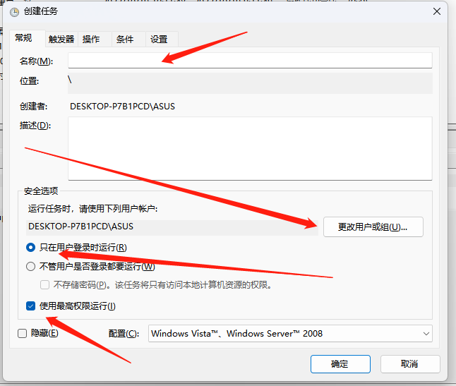
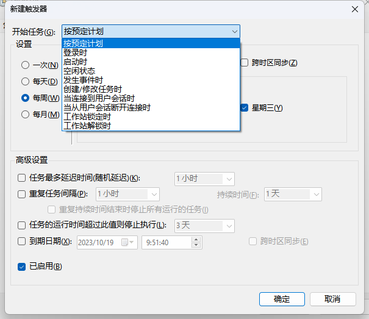
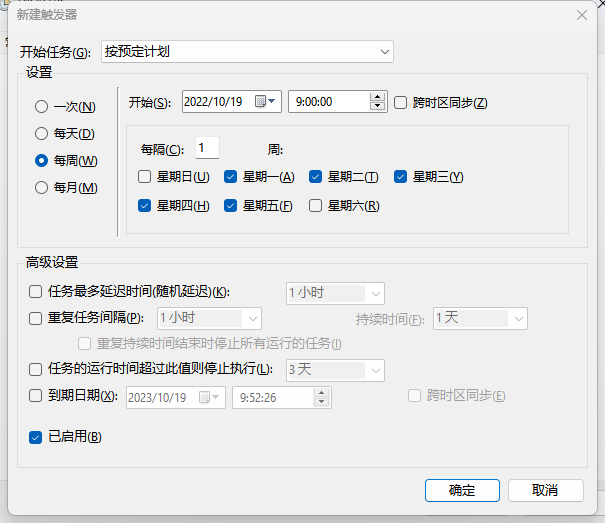
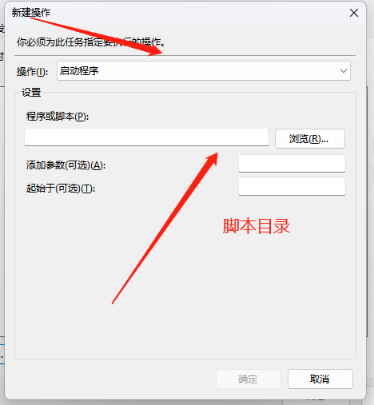
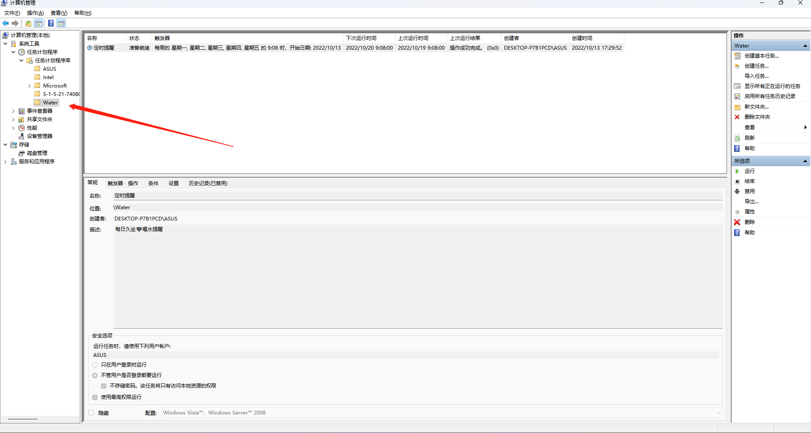
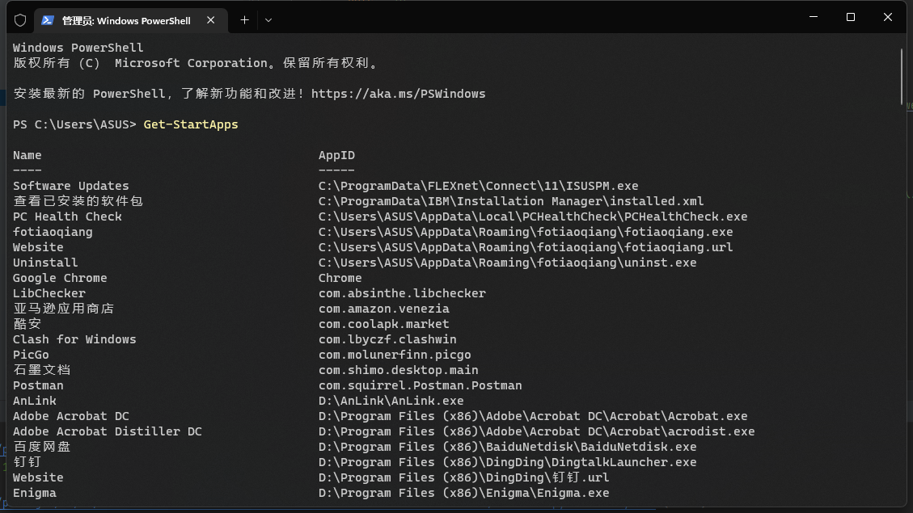

# Wintoast
借助win10+消息通知，提醒做某些事情

## 效果预览

- 全屏显示 


- 通知中心


## 借助window 任务计划程序 定时执行

### 配置定时任务

- 点击创建任务



- 新建触发器






- 新建操作



- 设置完成




### 使用vbs 无弹窗后台静默执行

- 复制文本，修改后缀为 `.vbs`

```commandline
set ws=WScript.CreateObject("WScript.Shell")
ws.Run "E:\Wintoast\Run.bat /start",0

```

- 复制文本，修改后缀为 `.bat`

```commandline
cd/d E:\Wintoast\
python wintoast.py
```

### 获取APPID

